# Codebase Understanding Prompts Using Diagrams

This README provides reusable prompts for understanding unfamiliar codebases through different architecture, system, data, runtime, and dependency diagrams. Each diagram includes a one-sentence description, a deeper explanation, and copy-ready prompts you can use with an AI coding assistant.

## How to Use This README

Use these prompts when exploring a new repository, onboarding to a system, reviewing architecture, preparing documentation, or deciding where to make changes safely. Replace placeholders such as `<repo>`, `<feature>`, `<service>`, `<module>`, `<entrypoint>`, and `<question>` with your actual context.

---

# 1. Architecture and System Context Diagrams

## [C4 System Context Diagram](#example-c4-system-context-diagram)

**One-sentence description:** A C4 System Context diagram shows the system as a whole and how it interacts with users and external systems.

A System Context diagram is usually the best starting point for understanding a codebase because it defines the system boundary. It answers questions like who uses the system, what external APIs or services it depends on, what data flows in and out, and which integrations are critical. This helps you avoid getting lost in implementation details before understanding what the software is actually responsible for.

```text
Analyze this codebase and create a C4 System Context diagram.

Focus on:
- The main system boundary
- Human users or roles
- External systems, APIs, databases, queues, and third-party services
- Major interactions between the system and its environment

Output:
1. A short explanation of the system boundary
2. A Mermaid diagram
3. A list of assumptions and unknowns
4. Files or directories that support each relationship
```

```text
Create a high-level system context map for <repo>.

Identify:
- Who uses this application
- What external systems it calls
- What systems call into it
- What data enters and leaves the system
- Which integrations appear business-critical

Use Mermaid and include evidence from the codebase where possible.
```

## [C4 Container Diagram](#example-c4-container-diagram)

**One-sentence description:** A C4 Container diagram shows the major deployable or runnable parts of a system and how they communicate.

Containers are things like web apps, APIs, background workers, databases, caches, queues, CLIs, mobile apps, or scheduled jobs. This diagram helps you understand runtime structure: what runs where, what talks to what, and what technology each part uses. It is especially useful for identifying deployment boundaries, service ownership, and operational dependencies.

```text
Analyze this repository and create a C4 Container diagram.

Identify all major runtime containers, including:
- Frontend apps
- Backend APIs
- Workers or jobs
- Databases
- Caches
- Message brokers
- External services

For each container, include:
- Main responsibility
- Technology or framework
- Key communication paths
- Relevant files or directories

Return a Mermaid diagram plus a short explanation.
```

```text
Map the deployable components in this codebase.

I want to understand:
- What processes run in production
- Which containers are internal vs external
- How requests move between them
- What persistence or messaging systems are involved
- Which configuration files define this structure

Generate a C4-style container diagram in Mermaid.
```

## [C4 Component Diagram](#example-c4-component-diagram)

**One-sentence description:** A C4 Component diagram breaks one container into its important internal modules and responsibilities.

A Component diagram is useful when you already know which service or application you care about and need to understand how its internals are organized. It can show controllers, services, repositories, adapters, clients, domain modules, middleware, and internal libraries. This helps you identify where a feature belongs and which components are likely to change together.

```text
Create a C4 Component diagram for <service_or_application> in this repository.

Focus on:
- Controllers, routes, handlers, or entrypoints
- Business logic services
- Data access components
- External API clients
- Shared utilities or libraries
- Important internal dependencies

Output:
1. Mermaid diagram
2. Responsibility of each component
3. Important source files for each component
4. Notes about coupling or unclear boundaries
```

```text
Break down the internal architecture of <module/service>.

Show the main components and how they collaborate to handle requests or jobs.
Include components only if they have meaningful architectural responsibility.
Avoid listing every class unless it is important.

Return a Mermaid C4-style component diagram and explanation.
```

## [C4 Code/Class Diagram](#example-c4-code-class-diagram)

**One-sentence description:** A C4 Code or Class diagram shows important classes, functions, interfaces, and relationships inside a component.

This is the most detailed C4 level and should be used selectively. It is helpful when you need to modify a complex feature, understand inheritance or interface boundaries, refactor code, or trace domain objects. Avoid using this diagram for the entire repository because it can become too noisy.

```text
Create a focused code-level diagram for <component_or_feature>.

Include:
- Key classes, interfaces, structs, or functions
- Important relationships such as inheritance, composition, dependency, or calls
- Main domain objects and data structures
- Only the details needed to understand or safely change this area

Return:
1. Mermaid class diagram or flowchart
2. Explanation of the important relationships
3. Files where each entity is defined
4. Risks to consider before editing
```

```text
I need to modify <feature>. Create a code-level diagram of the relevant implementation.

Trace the important classes/functions involved and show how they depend on each other.
Keep the diagram focused on the change area, not the whole repo.
Use Mermaid and cite source files.
```

---

# 2. Data and Flow Diagrams

## [Data Flow Diagram](#example-data-flow-diagram)

**One-sentence description:** A Data Flow Diagram, or DFD, shows how data moves between users, processes, stores, and external systems.

A DFD is especially useful for understanding APIs, ingestion pipelines, analytics systems, authentication flows, payment flows, and systems with sensitive data. It focuses less on code structure and more on where data comes from, how it is transformed, where it is stored, and where it exits the system. This makes it valuable for security reviews, privacy analysis, debugging data issues, and onboarding.

```text
Analyze this codebase and create a Data Flow Diagram for <feature_or_system>.

Identify:
- External entities that provide or consume data
- Main processes that transform data
- Data stores such as databases, files, caches, or queues
- Data flows between each part
- Sensitive data, trust boundaries, and validation points

Output a Mermaid diagram and explain each flow with supporting files.
```

```text
Create a DFD for how <data_type> moves through this system.

Show:
- Where the data enters
- How it is validated or transformed
- Where it is persisted
- Which services consume it
- Where it leaves the system
- Potential privacy, security, or data-quality risks

Use Mermaid and include evidence from the repository.
```

## [Sequence Diagram](#example-sequence-diagram)

**One-sentence description:** A Sequence diagram shows the order of interactions between actors, services, and components over time.

Sequence diagrams are excellent for understanding request lifecycles, async workflows, login flows, checkout flows, background job execution, and error handling. They make temporal behavior explicit, which helps reveal hidden dependencies, race conditions, retries, timeouts, and unclear responsibilities.

```text
Create a sequence diagram for <user_action_or_request> in this codebase.

Trace the flow from the entrypoint through all important components, including:
- User/client action
- API route or handler
- Service layer
- Database or cache calls
- External API calls
- Events, queues, or background jobs
- Response returned to the caller

Return a Mermaid sequence diagram and explain the main steps.
```

```text
Trace the runtime flow for <feature>.

I want to know exactly what happens, in order, when this feature is used.
Include success path, important branches, and likely failure paths.
Use a Mermaid sequence diagram and reference the files involved.
```

## [Activity Diagram / Workflow Diagram](#example-activity-workflow-diagram)

**One-sentence description:** An Activity or Workflow diagram shows decision points and steps in a business or application process.

Workflow diagrams are useful when the system behavior depends on conditions, states, approvals, retries, or user choices. They are easier to read than sequence diagrams when the main question is “what path does the process follow?” rather than “which component talks to which component?”

```text
Create an activity/workflow diagram for <business_process_or_feature>.

Show:
- Start and end states
- Main steps
- Decision points
- Error or retry paths
- Manual vs automated actions
- Where the code implements each step

Return a Mermaid flowchart and a short explanation.
```

```text
Explain the workflow for <feature> as a diagram.

Focus on the business logic and decisions, not every low-level function call.
Include alternate paths and failure handling if present.
Use Mermaid syntax.
```

## [State Machine Diagram](#example-state-machine-diagram)

**One-sentence description:** A State Machine diagram shows the valid states of an entity and the events that move it between states.

State diagrams are helpful for domains like orders, payments, subscriptions, tickets, jobs, deployments, user accounts, documents, and approvals. They reveal whether the code has explicit state rules, hidden transitions, invalid transitions, or missing edge-case handling.

```text
Find the lifecycle states for <entity> in this codebase and create a state machine diagram.

Identify:
- All possible states
- Events or actions that cause transitions
- Guards or conditions for transitions
- Terminal states
- Invalid or unclear transitions

Return a Mermaid state diagram plus notes about where each state and transition is implemented.
```

```text
Analyze the state lifecycle of <entity_or_process>.

Show the valid transitions as a Mermaid state machine diagram.
Also identify any states or transitions that appear implicit, duplicated, or risky.
```

---

# 3. Dependency and Structure Diagrams

## [Module Dependency Diagram](#example-module-dependency-diagram)

**One-sentence description:** A Module Dependency diagram shows how packages, directories, libraries, or modules depend on each other.

This diagram helps you understand code organization and coupling. It is useful before refactoring, extracting services, changing shared libraries, or identifying circular dependencies. It can also reveal architectural violations, such as UI modules importing persistence code directly or domain logic depending on infrastructure.

```text
Create a module dependency diagram for this repository.

Analyze imports, package references, and directory structure.
Show:
- Major modules or packages
- Dependency direction
- Circular dependencies
- Shared libraries
- Architecture boundary violations

Return a Mermaid graph and a concise explanation of the highest-risk dependencies.
```

```text
Map the dependencies around <module>.

Show what <module> imports, what imports it, and which dependencies are stable vs risky.
Use a Mermaid graph and include relevant files.
```

## [Package / Layered Architecture Diagram](#example-layered-architecture-diagram)

**One-sentence description:** A Layered Architecture diagram shows how responsibilities are separated across layers such as UI, API, domain, application, and infrastructure.

Layer diagrams are useful for determining whether a codebase follows a clear architecture. They help identify whether business logic lives in the right place, whether infrastructure concerns leak into domain code, and whether boundaries are consistently enforced.

```text
Analyze this repository and create a layered architecture diagram.

Identify layers such as:
- UI or presentation
- API/routes/controllers
- Application/use-case layer
- Domain/business logic
- Infrastructure/adapters
- Persistence/data access

Show allowed dependency direction and any violations.
Return a Mermaid diagram and supporting explanation.
```

```text
Does this codebase follow a layered architecture?

Create a diagram showing the actual layers and dependencies.
Then compare the actual structure to the expected dependency direction.
Highlight places where business logic, database access, or external calls appear in the wrong layer.
```

## [Import Graph](#example-import-graph)

**One-sentence description:** An Import Graph shows file-level or package-level import relationships.

Import graphs are practical when working in a large codebase and trying to understand what a file depends on or what might break if it changes. They are more mechanical than architecture diagrams but are useful for impact analysis, dependency cleanup, and circular import detection.

```text
Create an import graph for <file_or_module>.

Show:
- Direct imports
- Important transitive imports
- Files that import this file/module
- Any circular or suspicious dependencies
- Which imports are framework, internal, or third-party

Return a Mermaid graph and summarize the change impact risk.
```

```text
I am planning to edit <file>. Analyze its import graph.

Tell me:
- What it depends on
- What depends on it
- Whether it is high-risk to change
- Which tests likely cover it

Include a Mermaid graph.
```

---

# 4. Runtime, Deployment, and Infrastructure Diagrams

## [Deployment Diagram](#example-deployment-diagram)

**One-sentence description:** A Deployment diagram shows where software components run and which infrastructure resources they use.

Deployment diagrams connect code to the real production environment. They are useful for understanding hosting, networking, scaling, environment variables, databases, queues, storage buckets, serverless functions, and CI/CD deployment targets. They also help distinguish logical architecture from actual runtime topology.

```text
Create a deployment diagram for this codebase.

Use evidence from:
- Dockerfiles
- docker-compose files
- Kubernetes manifests
- Terraform or IaC files
- CI/CD configuration
- Environment variable references
- README deployment instructions

Show where each service runs and what infrastructure it depends on.
Return a Mermaid diagram and list the source files used.
```

```text
Map how this application is deployed.

Identify runtime environments, services, databases, queues, object storage, secrets, and external dependencies.
Use Mermaid and separate confirmed facts from assumptions.
```

## [Network / Trust Boundary Diagram](#example-network-trust-boundary-diagram)

**One-sentence description:** A Network or Trust Boundary diagram shows which components communicate across security boundaries.

This diagram is useful for security reviews and architecture risk analysis. It highlights public entrypoints, private networks, authentication boundaries, third-party calls, internal-only services, sensitive data zones, and places where validation or authorization should occur.

```text
Create a network and trust boundary diagram for this system.

Identify:
- Public entrypoints
- Internal services
- Private data stores
- External third-party systems
- Authentication and authorization boundaries
- Sensitive data flows
- Places where input validation should happen

Return a Mermaid diagram and a security-focused explanation.
```

```text
Analyze this codebase from a trust-boundary perspective.

Show which components are public, internal, privileged, or external.
Highlight risky crossings such as unauthenticated input, admin actions, secrets, PII, payment data, or direct database access.
Use a Mermaid diagram.
```

## [CI/CD Pipeline Diagram](#example-cicd-pipeline-diagram)

**One-sentence description:** A CI/CD Pipeline diagram shows how code moves from commit to build, test, release, and deployment.

CI/CD diagrams help you understand how changes become production software. They are useful for finding test gates, deployment environments, approval steps, artifact publishing, rollback processes, and automation gaps. They can be derived from GitHub Actions, GitLab CI, Jenkins, CircleCI, Azure DevOps, or other pipeline configs.

```text
Analyze the CI/CD configuration in this repository and create a pipeline diagram.

Show:
- Triggers
- Build steps
- Test steps
- Security or lint checks
- Artifact creation
- Deployment environments
- Manual approval gates
- Rollback or release steps if present

Return a Mermaid flowchart and explain each stage.
```

```text
Explain how a code change gets deployed from this repository.

Use CI/CD files, scripts, Makefiles, Dockerfiles, and deployment docs.
Create a Mermaid pipeline diagram and identify missing or weak quality gates.
```

---

# 5. Domain, API, and Data Model Diagrams

## [Entity Relationship Diagram](#example-entity-relationship-diagram)

**One-sentence description:** An Entity Relationship Diagram, or ERD, shows database entities, fields, and relationships.

ERDs are useful for understanding the persistent data model. They help clarify which tables or collections exist, how records relate, which fields are important, and where constraints or indexes may exist. They are especially useful before changing data access logic or writing migrations.

```text
Create an Entity Relationship Diagram for this codebase.

Use evidence from:
- Database migrations
- ORM models
- Schema files
- SQL files
- Repository/data-access code

Show entities, key fields, relationships, cardinality, and important constraints.
Return a Mermaid ER diagram and a short explanation.
```

```text
Analyze the data model for <feature_or_domain>.

Create an ERD showing the relevant tables/entities and relationships.
Include key fields only; avoid clutter.
Explain how the data model supports the feature.
```

## [API Endpoint Map](#example-api-endpoint-map)

**One-sentence description:** an API Endpoint Map shows the available routes, handlers, inputs, outputs, and downstream dependencies.

An API map is useful when joining a backend project, integrating with a service, or modifying a route. It helps you see the surface area of the application, where requests enter, which handlers process them, and which services or databases they depend on.

```text
Create an API endpoint map for this repository.

Identify:
- Routes and HTTP methods
- Handler/controller files
- Request parameters and body schemas
- Response shapes
- Authentication or authorization requirements
- Downstream services or databases used by each endpoint

Return a Mermaid diagram plus a compact endpoint table.
```

```text
Map the API surface for <service_or_feature>.

Show each endpoint, what it does, which code handles it, and what dependencies it calls.
Use Mermaid for the route-to-handler-to-service flow.
```

## [Domain Model Diagram](#example-domain-model-diagram)

**One-sentence description:** A Domain Model diagram shows the core business concepts and relationships independent of technical implementation.

Domain models are useful when the business logic is complex or unfamiliar. They help separate business concepts from database tables, API routes, and framework code. This is valuable for discussions with product, domain experts, and engineers before designing changes.

```text
Create a domain model diagram for <business_domain_or_feature>.

Identify:
- Core business concepts
- Relationships between concepts
- Important rules or invariants
- Terms that appear in code but need clarification
- Differences between domain concepts and database entities

Return a Mermaid class diagram or graph and explain the model in plain language.
```

```text
Extract the domain language from this codebase for <feature>.

Create a diagram of the main business entities and their relationships.
Avoid implementation details unless they clarify the domain.
List ambiguous terms or concepts that need human confirmation.
```

---

# 6. Change, Impact, and Debugging Diagrams

## [Change Impact Diagram](#example-change-impact-diagram)

**One-sentence description:** A Change Impact diagram shows what may be affected if a file, module, API, or behavior changes.

This diagram is useful before editing unfamiliar code. It shows upstream callers, downstream dependencies, tests, configuration, data stores, and external systems that could be affected. It helps reduce regression risk and guides what to test.

```text
I plan to change <file/module/feature>. Create a change impact diagram.

Show:
- Direct callers and upstream dependencies
- Downstream services, databases, or APIs
- Tests that likely cover this area
- Configuration or environment variables involved
- User-facing behavior that may change
- Risk level for each impacted area

Return a Mermaid graph and a recommended test plan.
```

```text
Before I modify <feature>, analyze the blast radius.

Create a diagram showing what depends on this code and what this code depends on.
Then summarize the safest implementation path and tests to run.
```

## [Debugging Trace Diagram](#example-debugging-trace-diagram)

**One-sentence description:** A Debugging Trace diagram follows a bug symptom backward through the likely code paths and dependencies.

A debugging trace diagram is useful when the system behavior is wrong but the responsible code is not obvious. It helps map symptoms to entrypoints, logs, state, data transformations, external dependencies, and failure points. This is especially useful for production bugs or flaky behavior.

```text
Help me debug this issue: <bug_description>.

Create a debugging trace diagram that shows:
- Where the symptom appears
- Likely entrypoints
- Relevant code paths
- Data transformations
- External dependencies
- Logs, metrics, or tests to inspect
- Most likely failure points

Return a Mermaid diagram and a prioritized investigation plan.
```

```text
Trace the likely source of <bug_or_unexpected_behavior> in this codebase.

Build a diagram from symptom to possible root causes.
Include files to inspect, assumptions, and how to confirm or reject each hypothesis.
```

## [Feature Flow Diagram](#example-feature-flow-diagram)

**One-sentence description:** A Feature Flow diagram shows all code and system parts involved in delivering one feature end to end.

Feature Flow diagrams combine architecture, sequence, data, and dependency perspectives into one practical view. They are useful when you want to understand a feature deeply enough to modify it or explain it to someone else.

```text
Create an end-to-end feature flow diagram for <feature>.

Include:
- User entrypoints
- UI components if present
- API routes or handlers
- Business logic
- Data access
- External services
- Events, queues, or jobs
- Storage
- Tests

Return a Mermaid diagram, explanation, and a list of likely files to edit for changes.
```

```text
Explain how <feature> works end to end in this repository.

Create a feature flow diagram that connects UI, backend, data, infrastructure, and tests where relevant.
Then identify the safest extension points for modifying the feature.
```

---

# 7. Decision and Knowledge Diagrams

## [Architecture Decision Map](#example-architecture-decision-map)

**One-sentence description:** An Architecture Decision Map connects important design choices to the code and configuration that implement them.

This diagram is helpful when a codebase contains patterns that are not obvious from code alone. It can reveal why a queue exists, why data is duplicated, why a service boundary exists, or why a certain framework pattern is used. It is useful during onboarding, refactoring, and architecture review.

```text
Analyze this codebase and create an architecture decision map.

Identify major design decisions such as:
- Framework choice
- Service boundaries
- Data storage approach
- Messaging or async processing
- Authentication model
- Deployment model
- Error handling strategy

For each decision, show where it appears in code and what tradeoff it suggests.
Use Mermaid and include open questions.
```

```text
What architectural decisions are implied by this repository?

Create a diagram linking decisions to implementation evidence.
Also identify decisions that are unclear, undocumented, or potentially outdated.
```

## [Concept Map](#example-concept-map)

**One-sentence description:** A Concept Map shows important terms, concepts, and relationships in a codebase or domain.

Concept maps are useful early in onboarding when names are unfamiliar. They help connect domain language, module names, database entities, API terms, and product concepts. Unlike ERDs or class diagrams, they are less formal and more focused on shared understanding.

```text
Create a concept map for this codebase.

Identify important terms from:
- Directory names
- Class and function names
- API routes
- Database entities
- Documentation
- Tests

Group related concepts and show relationships in Mermaid.
Also list terms that are ambiguous or overloaded.
```

```text
I am new to this repository. Build a concept map of the main terms and ideas.

Focus on helping me understand the vocabulary before I edit code.
Use Mermaid and explain the most important relationships.
```

---

# 8. Suggested Workflow for Understanding a New Codebase

Use these diagrams in this order for a balanced understanding:

1. **C4 System Context Diagram** — understand the system boundary.
2. **C4 Container Diagram** — understand runtime parts.
3. **API Endpoint Map** — understand entrypoints.
4. **Data Flow Diagram** — understand how data moves.
5. **ERD** — understand persistence.
6. **Sequence Diagram** — understand one important user flow.
7. **Component Diagram** — understand the service you need to change.
8. **Change Impact Diagram** — understand risk before editing.

```text
I am onboarding to this repository. Guide me through understanding it using diagrams.

Please create the following, in order:
1. C4 System Context diagram
2. C4 Container diagram
3. API Endpoint Map
4. Data Flow Diagram for the most important flow
5. ERD for the main data model
6. Sequence Diagram for the most important user action
7. Component Diagram for the most important backend service
8. Change Impact Diagram for a likely first change

For each diagram:
- Use Mermaid
- Explain what it teaches me
- Cite the files that support it
- List assumptions and unknowns
```

---

# Examples

The examples below use a fictional order-processing application with a web client, API service, worker, database, queue, cache, and payment provider.

## Example: C4 System Context Diagram

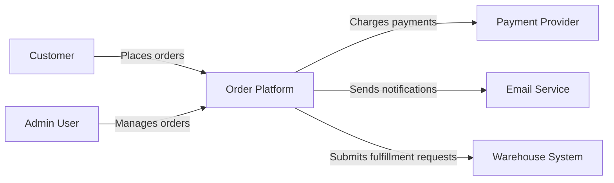

## Example: C4 Container Diagram

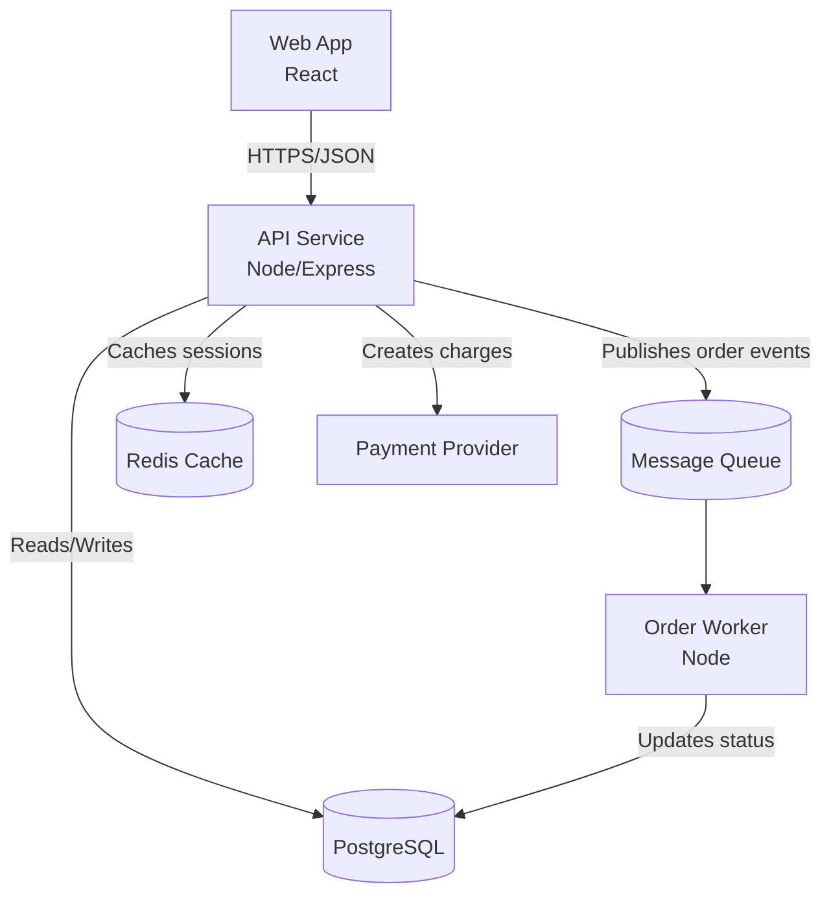

## Example: C4 Component Diagram

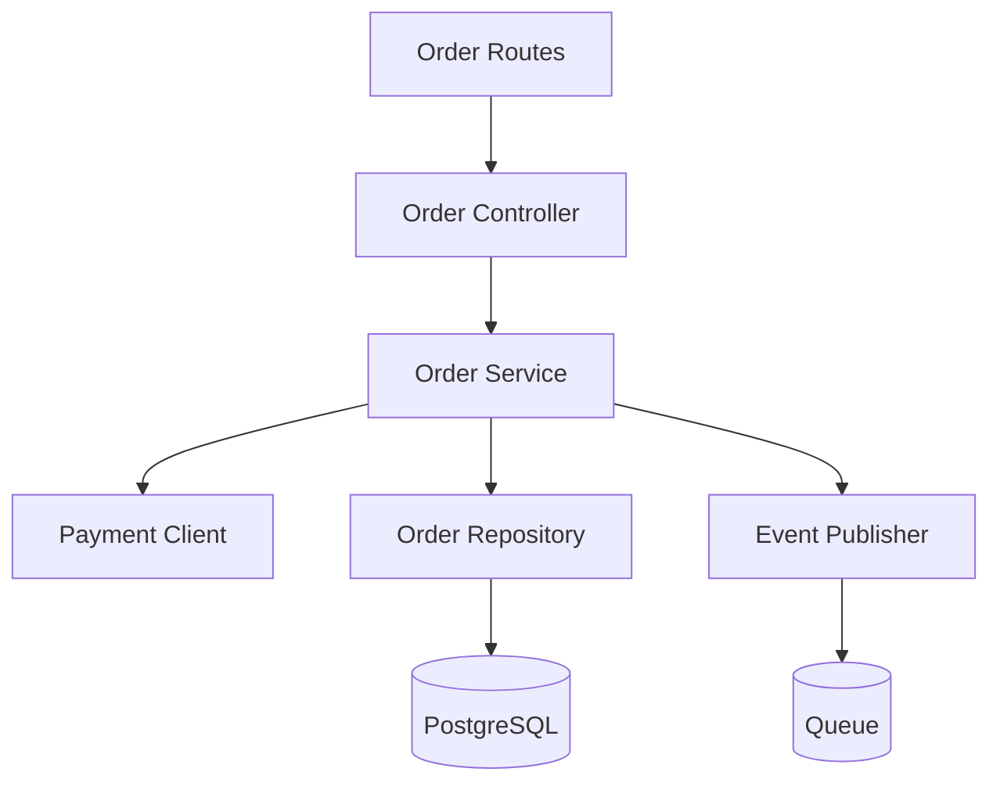

## Example: C4 Code Class Diagram

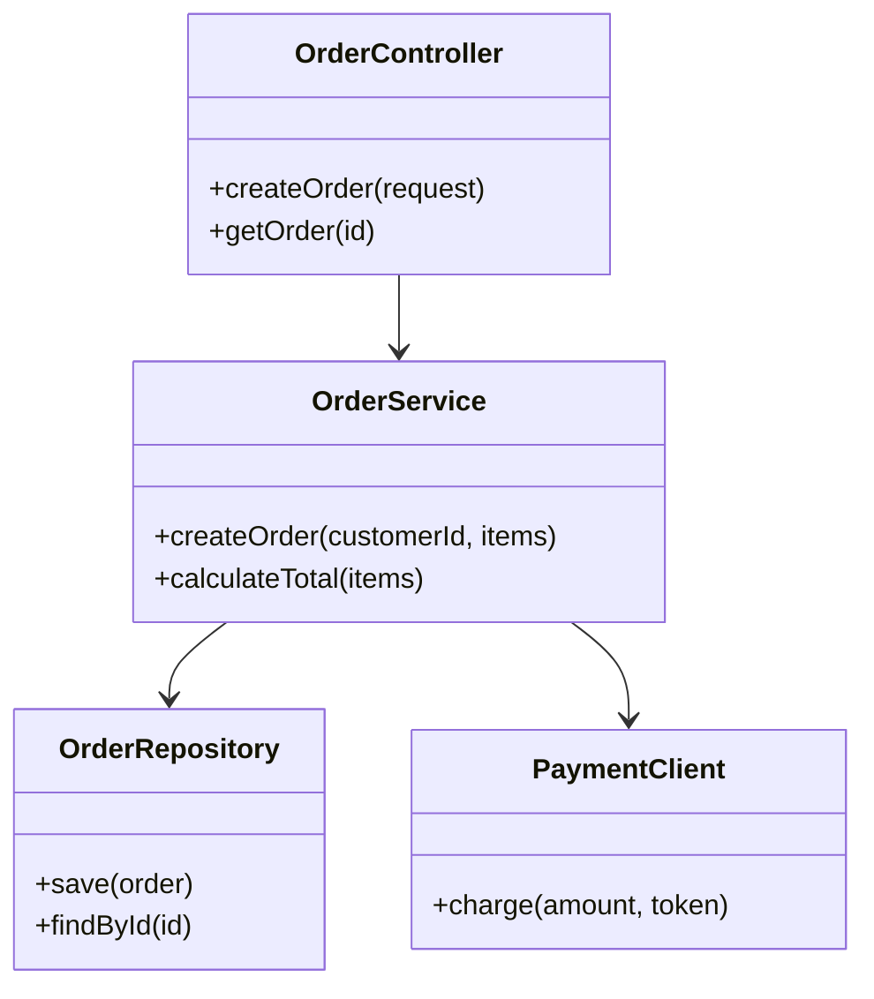

## Example: Data Flow Diagram

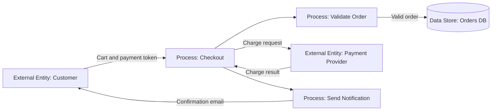

## Example: Sequence Diagram

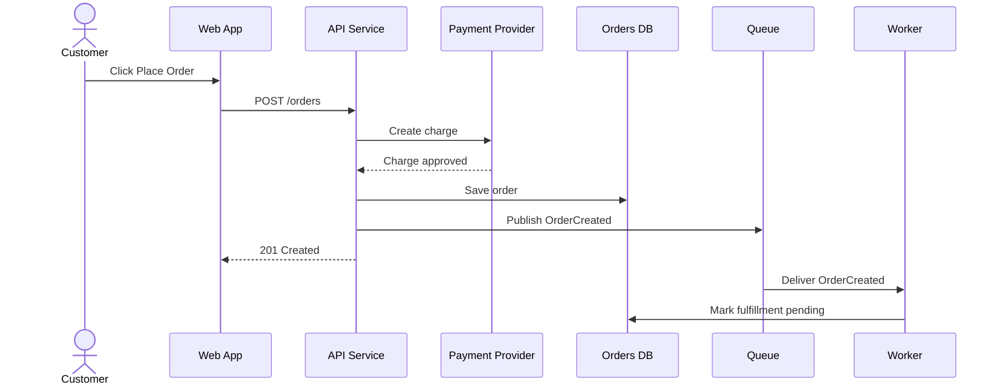

## Example: Activity Workflow Diagram

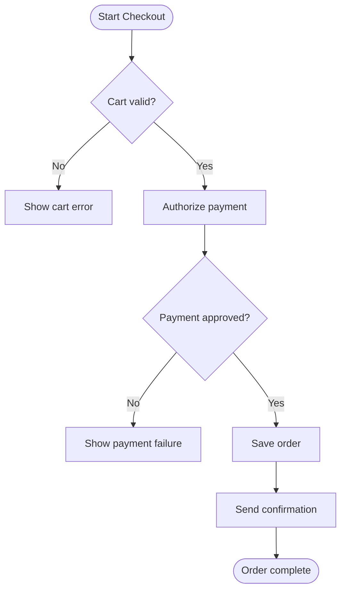

## Example: State Machine Diagram

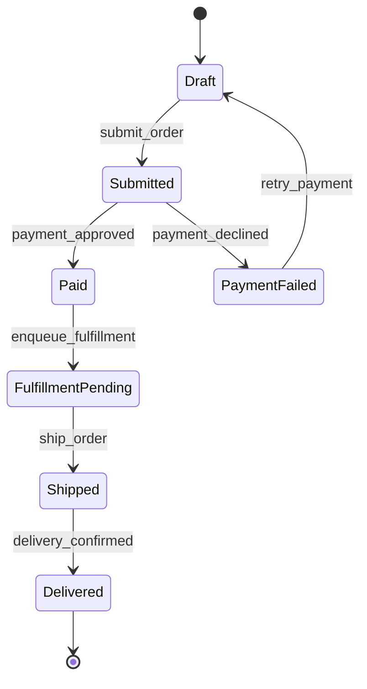

## Example: Module Dependency Diagram

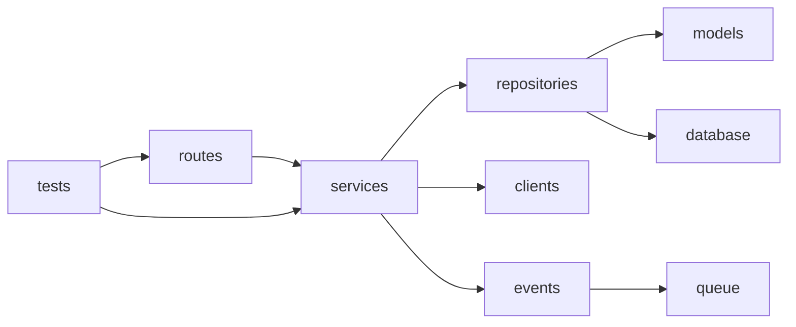

## Example: Layered Architecture Diagram

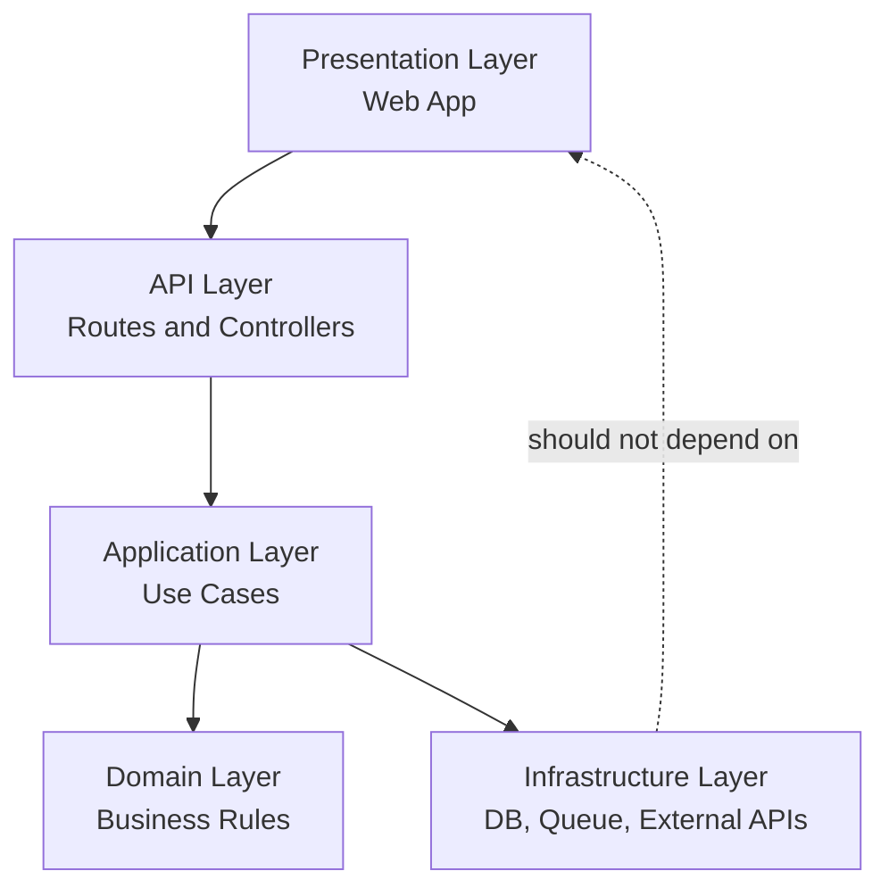

## Example: Import Graph

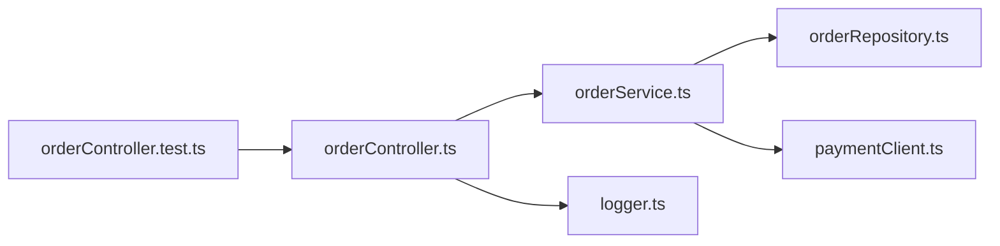

## Example: Deployment Diagram

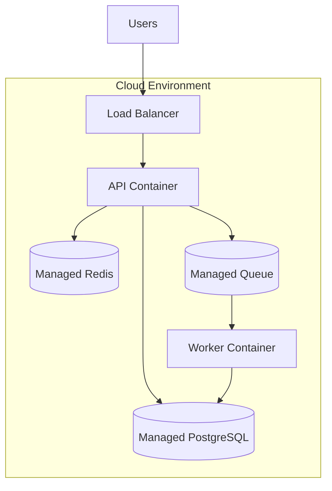

## Example: Network Trust Boundary Diagram

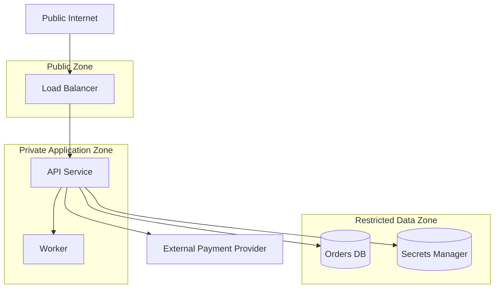

## Example: CI/CD Pipeline Diagram

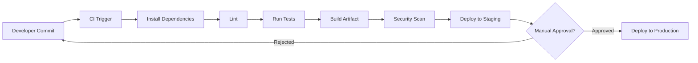

## Example: Entity Relationship Diagram

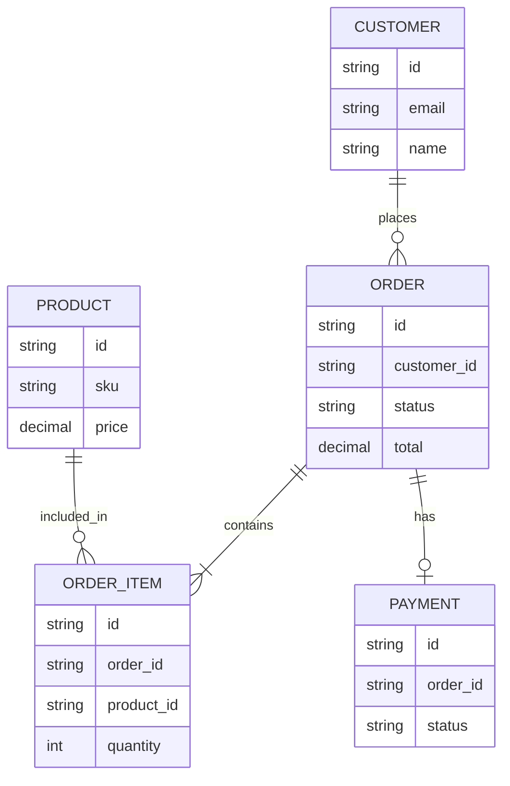

## Example: API Endpoint Map

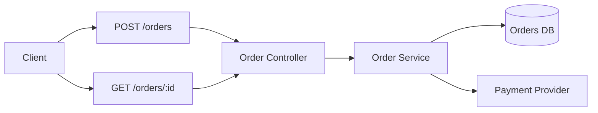

## Example: Domain Model Diagram

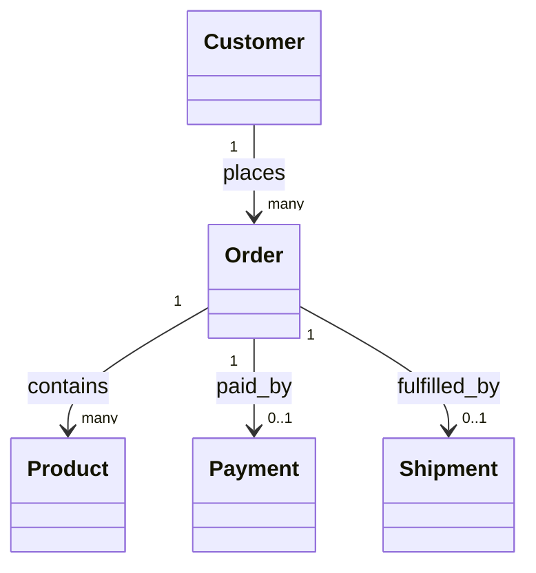

## Example: Change Impact Diagram

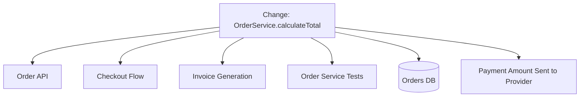

## Example: Debugging Trace Diagram

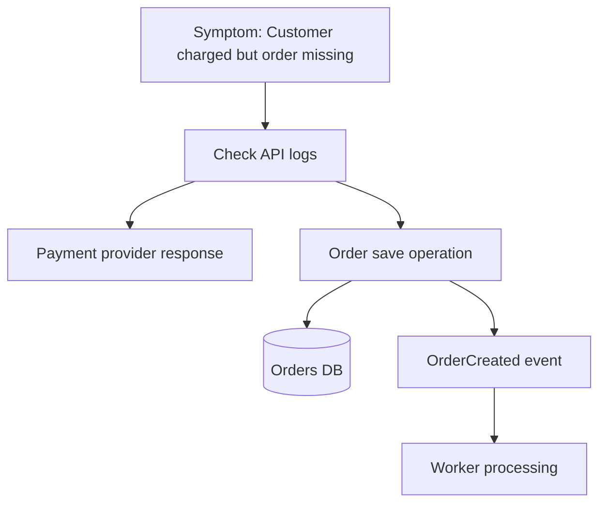

## Example: Feature Flow Diagram

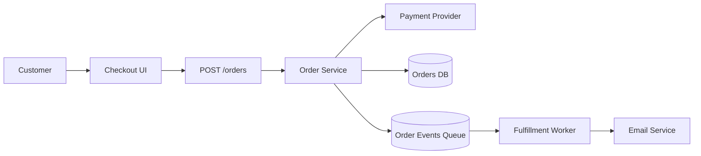

## Example: Architecture Decision Map

```mermaid
flowchart TB
    Decision1[Decision: Async fulfillment]
    Queue[Queue usage]
    Worker[Worker service]
    Decision2[Decision: External payment provider]
    PaymentClient[Payment client adapter]
    Decision3[Decision: PostgreSQL persistence]
    ORM[ORM models]
    Migrations[DB migrations]

    Decision1 --> Queue
    Decision1 --> Worker
    Decision2 --> PaymentClient
    Decision3 --> ORM
    Decision3 --> Migrations
```

## Example: Concept Map

```mermaid
flowchart LR
    Customer --> Order
    Order --> Payment
    Order --> Fulfillment
    Fulfillment --> Shipment
    Order --> OrderItem
    OrderItem --> Product
    Payment --> Refund
    Customer --> NotificationPreference
```
