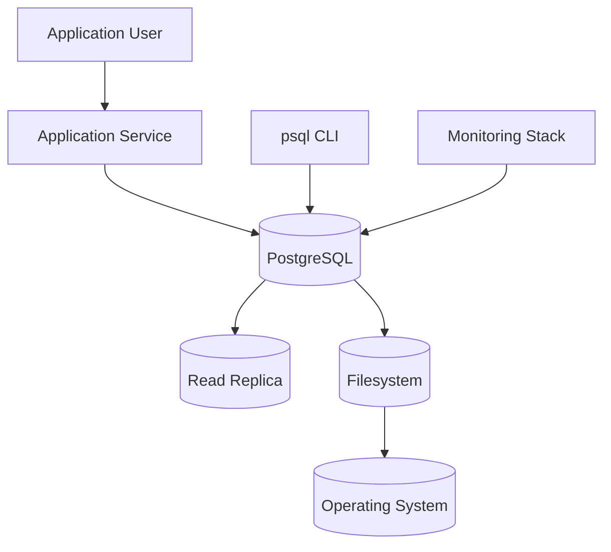
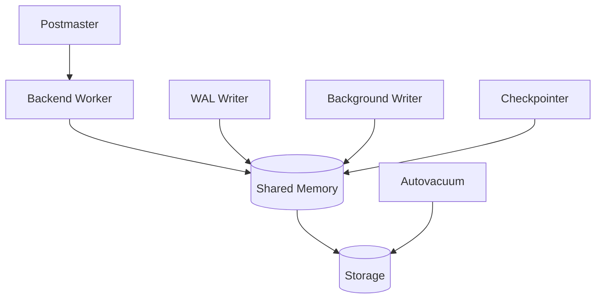
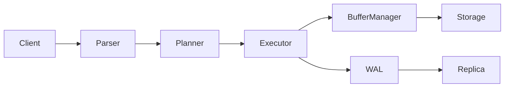
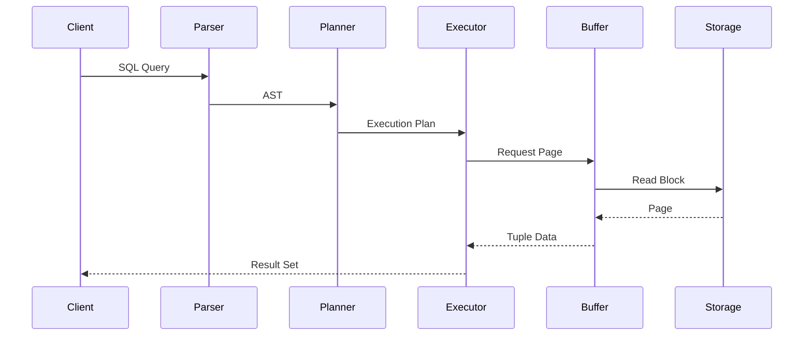
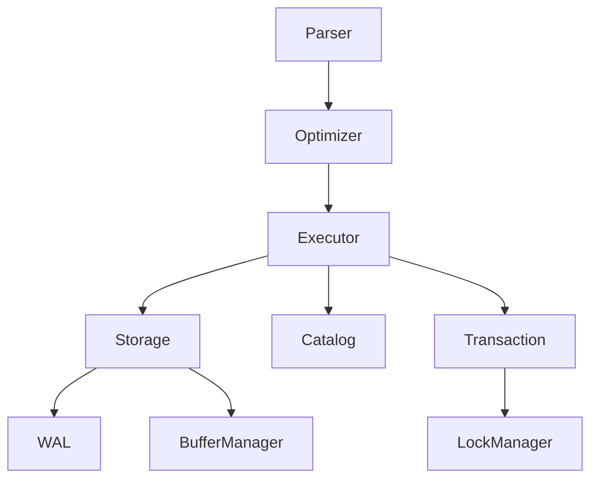
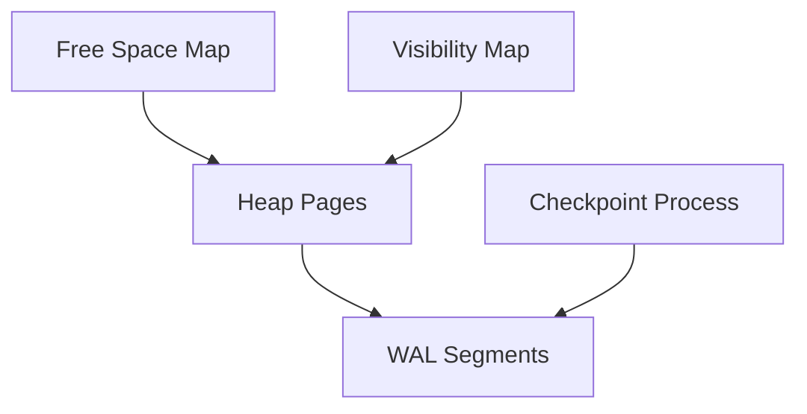
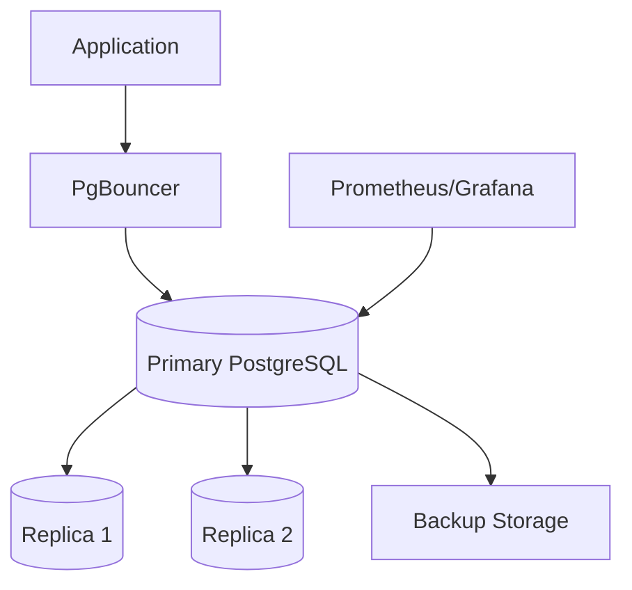
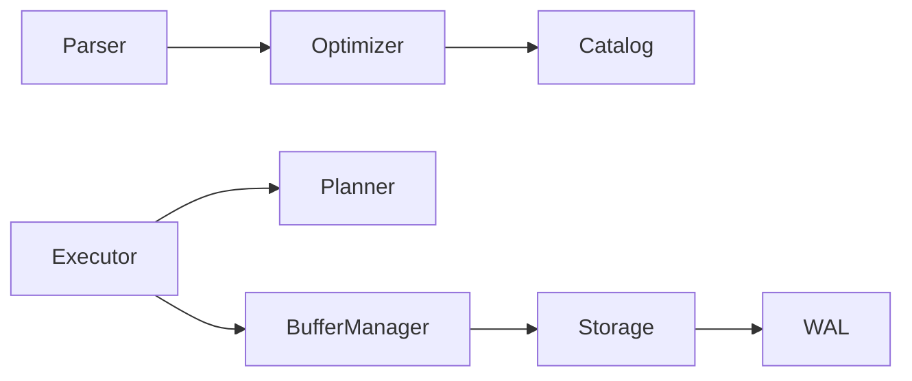
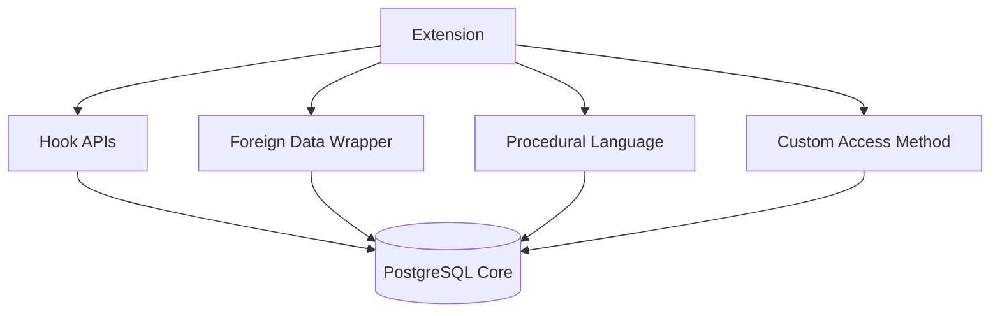

# PostgreSQL Codebase Architecture Case Study
## A Complete Diagram-Driven Walkthrough of `postgres/postgres`

Repository: urlPostgreSQL GitHub Repositoryhttps://github.com/postgres/postgres

---

# Introduction

This document demonstrates how to systematically understand a very large and mature open-source codebase using multiple architecture and engineering diagrams.

The target repository is:

- PostgreSQL (`postgres/postgres`)
- ~1M+ lines of C code
- Decades of history
- Multiple execution subsystems
- Deep storage and query execution internals
- Process-based architecture
- Distributed contributor model

The goal is NOT merely to document the system.

The goal is to create a repeatable methodology for:
- onboarding into unfamiliar systems
- debugging production issues
- understanding execution flow
- identifying ownership boundaries
- tracing data movement
- finding extension points
- preparing for refactors
- contributing safely

---

# Recommended Diagram Order

The order matters.

You should NOT start with implementation details.

Instead:

1. System Context
2. Container Diagram
3. High-Level Data Flow
4. Runtime / Sequence Diagrams
5. Component Diagrams
6. Storage Layout
7. DFD
8. Module Dependency Graphs
9. Deployment Architecture
10. Extension / Plugin Architecture

---

# 1. System Context Diagram

[Jump to Example](#example-system-context-diagram)

## Purpose

A System Context diagram explains:
- what PostgreSQL interacts with
- external systems
- users
- clients
- replication consumers
- monitoring tools

It defines system boundaries.

This is the BEST first diagram for onboarding.

## What We Learn

From PostgreSQL:
- clients connect over TCP
- applications issue SQL
- WAL streams to replicas
- extensions hook into internals
- OS handles process scheduling and filesystems

## Suggested Prompt

```text
Analyze the postgres/postgres repository.

Create a System Context Diagram showing:
- PostgreSQL server
- client applications
- psql CLI
- replication replicas
- monitoring systems
- filesystem
- operating system
- extension ecosystem

Show:
- network boundaries
- major protocols
- external dependencies
- trust boundaries

Then explain:
- primary runtime responsibilities
- critical external interactions
- operational risks
- scaling implications
```

---

# 2. C4 Container Diagram

[Jump to Example](#example-c4-container-diagram)

## Purpose

Container diagrams divide the system into deployable/runtime units.

For PostgreSQL this is extremely important because:
- PostgreSQL is process-oriented
- not thread-oriented
- multiple runtime processes coordinate internally

## What We Learn

Key runtime containers:
- postmaster
- backend worker
- WAL writer
- autovacuum
- checkpointer
- background writer
- replication sender
- shared memory subsystem

## Suggested Prompt

```text
Create a C4 Container Diagram for postgres/postgres.

Identify:
- runtime processes
- shared memory usage
- WAL pipeline
- background workers
- query execution workers
- replication processes

Explain:
- responsibilities of each process
- communication mechanisms
- lifecycle management
- fault isolation behavior
- startup and shutdown orchestration
```

---

# 3. High-Level Data Flow Diagram (DFD)

[Jump to Example](#example-data-flow-diagram)

## Purpose

A DFD explains movement of data through the system.

For databases this is critical.

You should understand:
- SQL ingestion
- parsing
- planning
- execution
- storage access
- WAL creation
- replication

## What We Learn

PostgreSQL execution pipeline:
1. SQL received
2. Parser creates AST
3. Planner builds execution plan
4. Executor runs operators
5. Buffer manager loads pages
6. Storage manager reads files
7. WAL emitted

## Suggested Prompt

```text
Generate a Level 1 and Level 2 Data Flow Diagram for PostgreSQL.

Trace:
- incoming SQL
- parser output
- planner transformations
- executor behavior
- storage reads/writes
- WAL generation
- replication flow

Highlight:
- synchronization points
- disk boundaries
- shared memory interactions
- transaction lifecycle
```

---

# 4. Query Execution Sequence Diagram

[Jump to Example](#example-query-sequence-diagram)

## Purpose

Sequence diagrams explain runtime behavior over time.

This is one of the MOST valuable diagrams for debugging.

## What We Learn

How a query moves through:
- parser
- rewriter
- planner
- optimizer
- executor
- buffer manager
- storage

## Suggested Prompt

```text
Create a detailed sequence diagram for execution of a SQL SELECT query in PostgreSQL.

Include:
- client connection
- parser
- analyzer
- planner
- optimizer
- executor
- buffer manager
- storage manager
- WAL interaction (if relevant)

Show:
- synchronization points
- memory allocations
- lock acquisition
- transaction visibility checks
- buffer cache usage
```

---

# 5. Component Diagram

[Jump to Example](#example-component-diagram)

## Purpose

Component diagrams explain internal module boundaries.

This is where understanding becomes practical for contributors.

## What We Learn

Major PostgreSQL subsystems:
- parser
- optimizer
- executor
- catalog
- storage
- access methods
- MVCC visibility
- lock manager

## Suggested Prompt

```text
Generate a PostgreSQL component diagram.

Identify:
- parser subsystem
- optimizer subsystem
- executor subsystem
- storage subsystem
- catalog subsystem
- transaction subsystem
- lock manager
- buffer manager

For each component explain:
- responsibilities
- public APIs
- ownership boundaries
- important source directories
- extension points
```

---

# 6. Storage Engine Diagram

[Jump to Example](#example-storage-engine-diagram)

## Purpose

PostgreSQL storage internals are sophisticated.

A storage diagram explains:
- pages
- tuples
- MVCC
- WAL
- indexes
- checkpoints

## What We Learn

Key concepts:
- heap pages
- tuple visibility
- FSM
- visibility map
- WAL segments
- checkpoints

## Suggested Prompt

```text
Create a storage architecture diagram for PostgreSQL.

Explain:
- heap page structure
- tuple lifecycle
- MVCC visibility
- WAL segments
- checkpoints
- FSM
- visibility map
- index interaction

Show:
- durability guarantees
- crash recovery mechanisms
- vacuum interactions
```

---

# 7. Deployment Diagram

[Jump to Example](#example-deployment-diagram)

## Purpose

Deployment diagrams explain production topology.

This matters for:
- operations
- reliability
- scaling
- HA

## What We Learn

Typical deployments:
- primary DB
- read replicas
- backup systems
- monitoring stack
- connection poolers

## Suggested Prompt

```text
Create a deployment diagram for PostgreSQL in a production HA environment.

Include:
- primary node
- streaming replicas
- backup systems
- connection poolers
- monitoring systems
- failover management

Show:
- replication channels
- failover flow
- operational dependencies
- storage boundaries
```

---

# 8. Module Dependency Graph

[Jump to Example](#example-module-dependency-graph)

## Purpose

Dependency graphs reveal:
- architectural complexity
- layering violations
- cyclic dependencies
- tightly coupled subsystems

## What We Learn

Critical dependencies:
- optimizer depends on catalog
- executor depends on planner
- storage depends on buffer manager
- WAL spans many layers

## Suggested Prompt

```text
Analyze postgres/postgres source dependencies.

Generate a module dependency graph showing:
- subsystem dependencies
- forbidden coupling
- dependency hotspots
- layering violations
- cyclic dependency risks

Recommend:
- refactor opportunities
- isolation boundaries
- modularization improvements
```

---

# 9. Extension Architecture Diagram

[Jump to Example](#example-extension-architecture-diagram)

## Purpose

PostgreSQL is highly extensible.

This is one reason it became dominant.

## What We Learn

Extension mechanisms:
- hooks
- custom types
- operators
- FDWs
- access methods
- procedural languages

## Suggested Prompt

```text
Create an extension architecture diagram for PostgreSQL.

Include:
- extension loading
- hooks
- custom operators
- procedural languages
- FDWs
- access methods
- extension APIs

Explain:
- extension lifecycle
- isolation guarantees
- ABI concerns
- security implications
```

---

# 10. Suggested Exploration Workflow

## Phase 1 — Macro Understanding

Start with:
- System Context
- Deployment Diagram
- Container Diagram

Goal:
Understand runtime topology.

---

## Phase 2 — Runtime Behavior

Then:
- Sequence Diagrams
- DFDs

Goal:
Understand execution flow.

---

## Phase 3 — Deep Internal Structure

Then:
- Component Diagram
- Dependency Graphs
- Storage Internals

Goal:
Understand implementation boundaries.

---

## Phase 4 — Contribution Readiness

Finally:
- Extension Architecture
- Ownership Mapping
- Critical Paths

Goal:
Safely modify the codebase.

---

# Key PostgreSQL Source Directories

| Directory | Purpose |
|---|---|
| `src/backend/parser` | SQL parsing |
| `src/backend/optimizer` | Query optimization |
| `src/backend/executor` | Query execution |
| `src/backend/access` | Storage access methods |
| `src/backend/storage` | Buffer/storage internals |
| `src/backend/utils` | Utilities and catalogs |
| `src/backend/replication` | Replication logic |
| `src/include` | Shared headers |
| `contrib` | Extensions |

---

# Recommended Questions While Exploring

## Architecture

- What owns transaction visibility?
- What guarantees durability?
- What crosses process boundaries?
- Where are locks acquired?

## Runtime

- What allocates memory?
- What blocks?
- What touches disk?
- What emits WAL?

## Reliability

- What survives crashes?
- What is replayable?
- What is idempotent?
- What requires synchronization?

---

# Example Mermaid Diagrams

---

# Example System Context Diagram



---

# Example C4 Container Diagram



---

# Example Data Flow Diagram



---

# Example Query Sequence Diagram



---

# Example Component Diagram



---

# Example Storage Engine Diagram



---

# Example Deployment Diagram



---

# Example Module Dependency Graph



---

# Example Extension Architecture Diagram



---

# Final Takeaways

Large codebases become understandable when viewed through multiple architectural lenses.

Each diagram answers different questions:

| Diagram | Primary Question |
|---|---|
| System Context | What does the system interact with? |
| Container | What runtime units exist? |
| DFD | How does data move? |
| Sequence | What happens over time? |
| Component | How is code organized? |
| Storage | How is data persisted? |
| Deployment | How is it operated? |
| Dependency Graph | What is tightly coupled? |
| Extension Diagram | How is the system extended? |

The key is layering these perspectives together.

That transforms a massive unfamiliar repository into a navigable engineering system.
