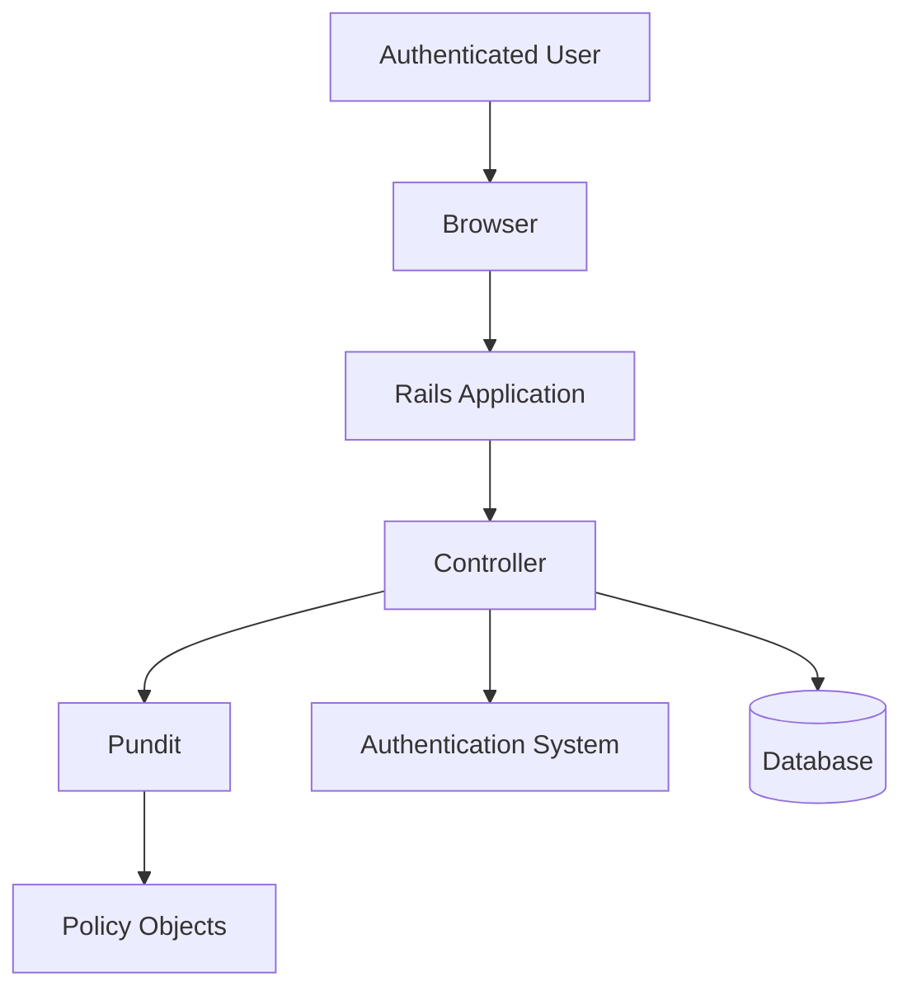
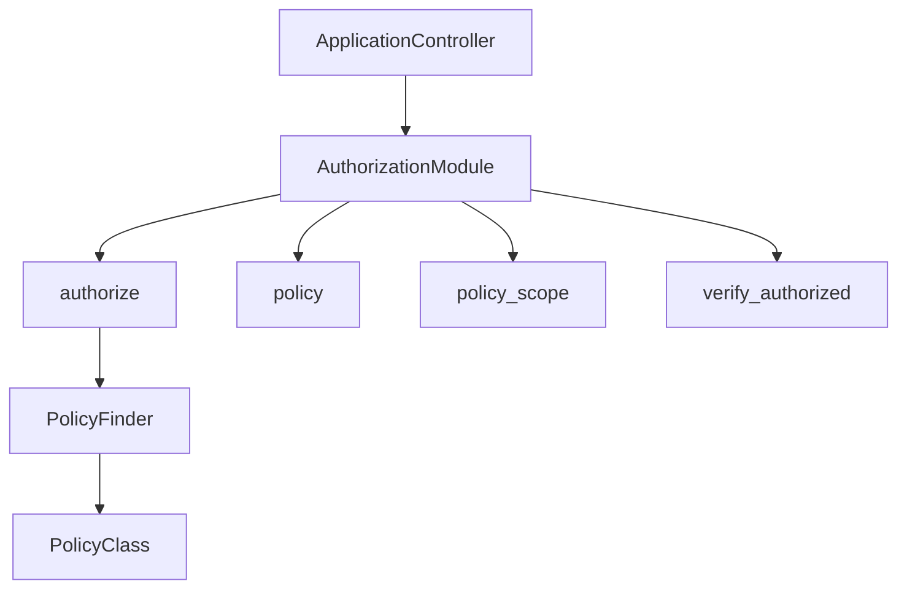
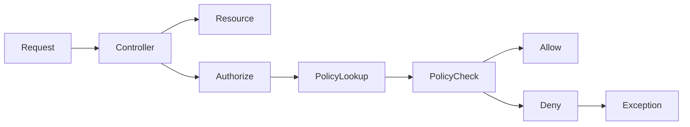
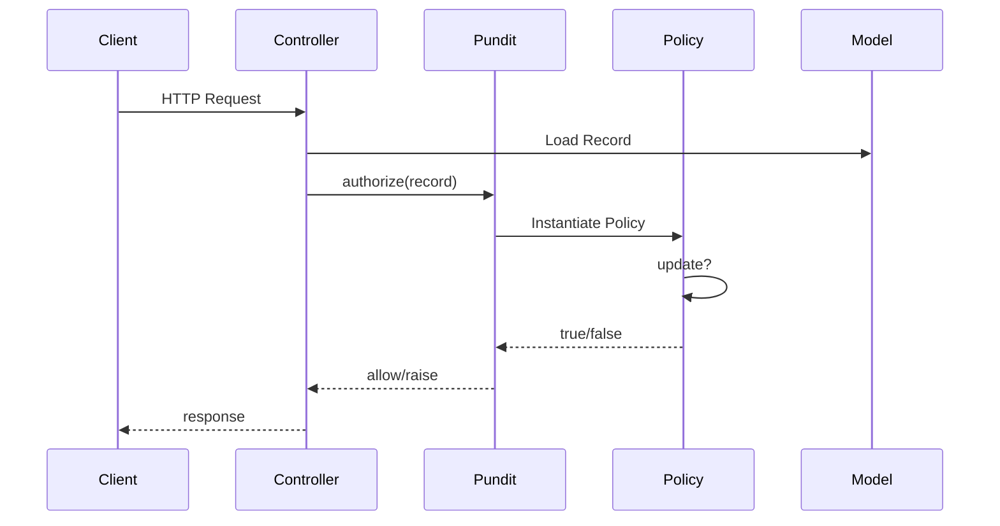
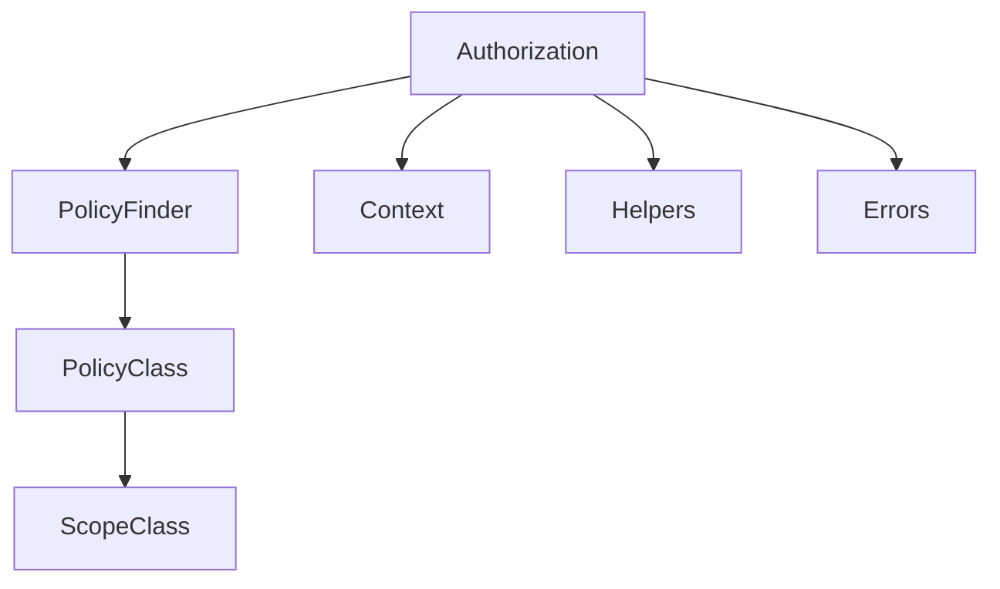
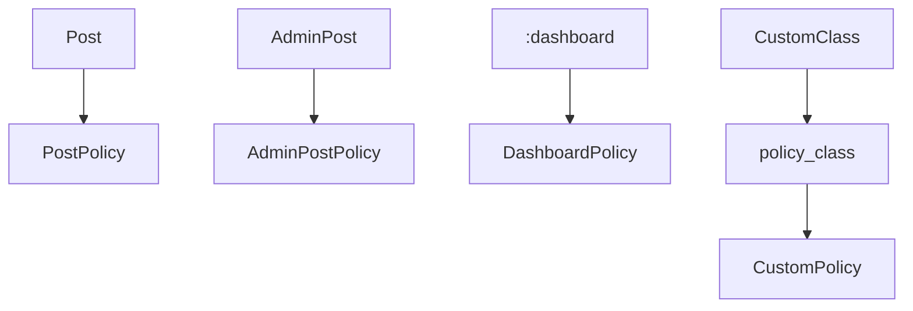
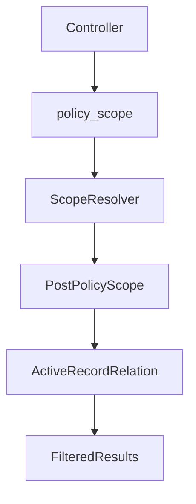
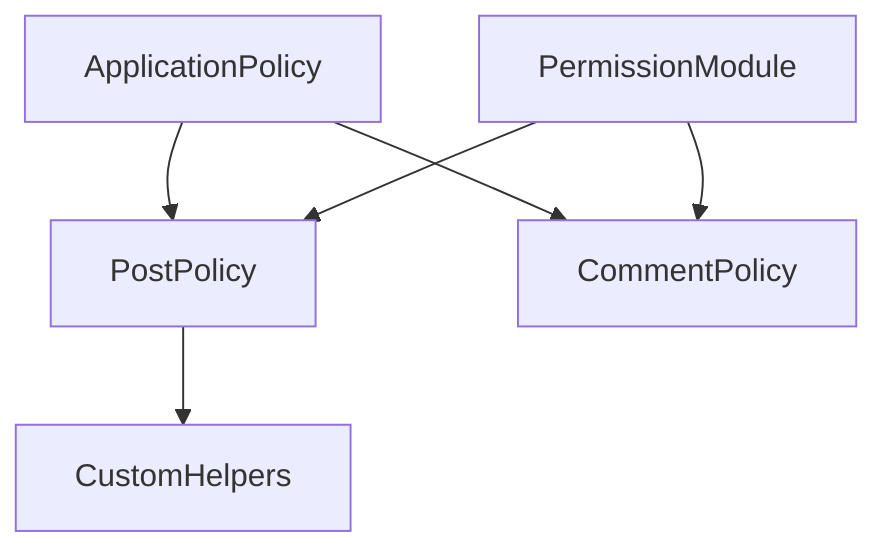
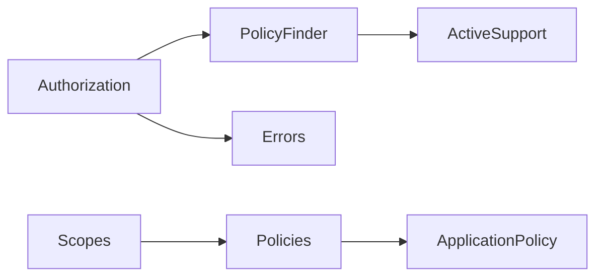
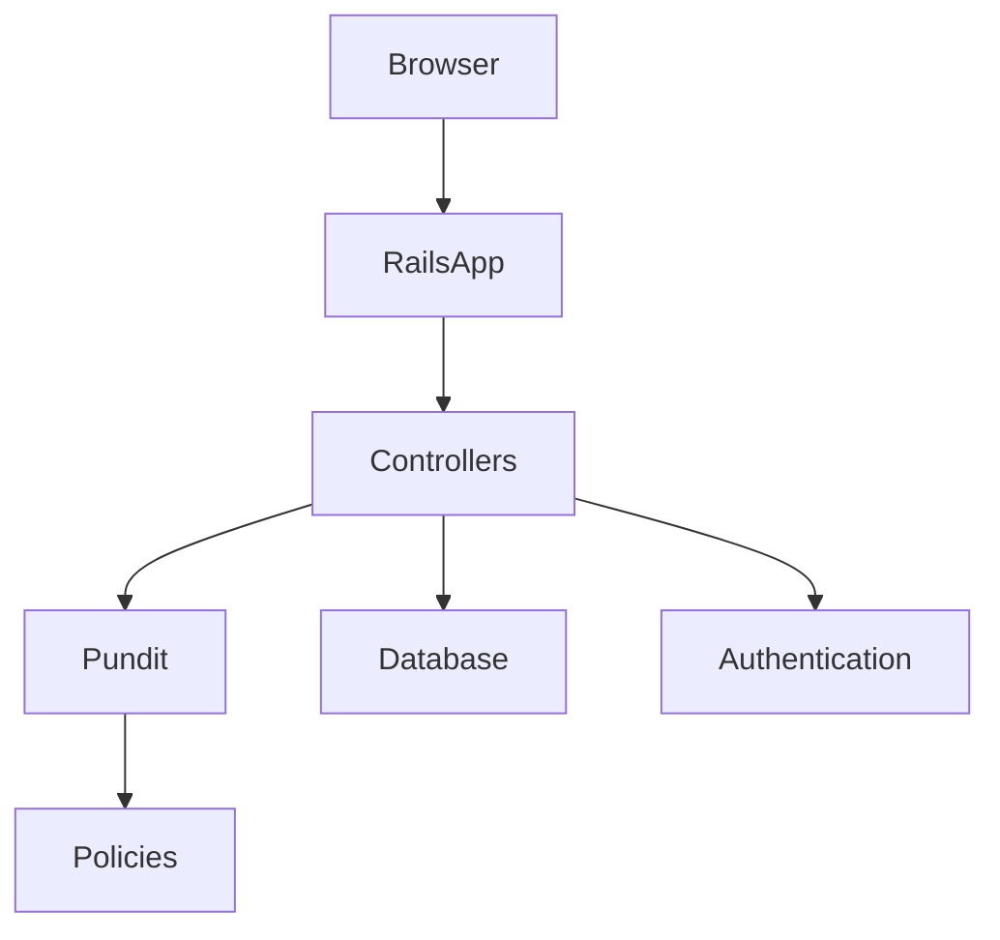

# Pundit Codebase Architecture Case Study
## A Complete Diagram-Driven Walkthrough of `varvet/pundit`

Repository: urlPundit GitHub Repositoryhttps://github.com/varvet/pundit

---

# Introduction

This document demonstrates how to understand a compact but highly influential Ruby/Rails library using layered architectural diagrams.

The target repository is:

- `varvet/pundit`
- A lightweight authorization framework for Ruby on Rails
- Built around plain Ruby objects (POROs)
- Widely adopted across the Rails ecosystem
- Strong example of minimalist library architecture

Pundit is especially interesting because:
- it intentionally avoids DSL-heavy abstractions
- it leverages Ruby object-oriented patterns
- it integrates deeply into Rails without becoming invasive
- its simplicity hides important runtime flows

This case study demonstrates how to:
- understand Rails library architecture
- analyze extension-oriented frameworks
- trace authorization flow
- map policy resolution behavior
- identify integration points
- reason about framework ergonomics

---

# Recommended Diagram Order

The recommended order for understanding Pundit:

1. System Context Diagram
2. Rails Integration Diagram
3. Authorization Data Flow Diagram
4. Request Sequence Diagram
5. Component Diagram
6. Policy Resolution Diagram
7. Scope Resolution Diagram
8. Extension & Customization Diagram
9. Dependency Graph
10. Production Usage Deployment Diagram

---

# 1. System Context Diagram

[Jump to Example](#example-system-context-diagram)

## Purpose

The System Context Diagram explains:
- where Pundit fits in a Rails application
- what components interact with it
- what runtime responsibilities it owns
- what it intentionally does NOT own

This is the BEST starting point.

## What We Learn

Pundit:
- does authorization
- does NOT do authentication
- integrates into Rails controllers/views
- depends on application-defined policy classes
- delegates logic to user-owned objects

## Key Insight

Pundit is intentionally "small surface area" architecture.

Almost all business logic remains in the host application.

## Suggested Prompt

```text
Analyze the varvet/pundit repository.

Create a System Context Diagram showing:
- Rails controllers
- models
- policy classes
- users
- views
- authentication layer
- Pundit authorization layer

Explain:
- what Pundit owns
- what the application owns
- trust boundaries
- runtime responsibilities
- integration flow
```

---

# 2. Rails Integration Diagram

[Jump to Example](#example-rails-integration-diagram)

## Purpose

Pundit is fundamentally a Rails integration library.

This diagram explains:
- how modules are included
- how controller helpers work
- how authorization hooks execute
- how exceptions propagate

## What We Learn

Key integration points:
- `include Pundit::Authorization`
- `authorize`
- `policy`
- `policy_scope`
- `verify_authorized`

## Key Insight

Pundit injects a very small API surface into Rails controllers.

Most logic stays externalized.

## Suggested Prompt

```text
Create a Rails integration architecture diagram for Pundit.

Include:
- ActionController integration
- helper injection
- policy lookup
- authorization flow
- exception handling
- view helpers

Explain:
- lifecycle hooks
- controller integration
- helper responsibilities
- Rails conventions leveraged
```

---

# 3. Authorization Data Flow Diagram (DFD)

[Jump to Example](#example-authorization-data-flow-diagram)

## Purpose

The DFD explains how authorization decisions flow through the system.

This is critical because authorization systems are fundamentally about:
- information flow
- trust decisions
- permission evaluation

## What We Learn

Typical flow:
1. Controller receives request
2. Resource loaded
3. `authorize` called
4. Policy resolved
5. Predicate executed
6. Access granted or denied

## Key Insight

Pundit itself does not know authorization rules.

The application owns them.

## Suggested Prompt

```text
Generate a Data Flow Diagram for Pundit authorization.

Trace:
- incoming HTTP request
- controller action
- authorize() call
- policy lookup
- permission evaluation
- exception flow
- response generation

Highlight:
- trust boundaries
- user-controlled data
- authorization checkpoints
- denial paths
```

---

# 4. Request Authorization Sequence Diagram

[Jump to Example](#example-request-sequence-diagram)

## Purpose

This is one of the MOST valuable diagrams.

It explains runtime behavior over time.

## What We Learn

Execution flow:
- request enters Rails
- controller resolves model
- policy instantiated
- query method called
- authorization succeeds/fails

## Key Insight

Pundit is mostly orchestration and convention resolution.

## Suggested Prompt

```text
Create a sequence diagram for a Rails request using Pundit authorization.

Include:
- browser/client
- Rails router
- controller
- Pundit authorization module
- policy class
- model
- exception handling

Show:
- authorize() call
- policy inference
- policy initialization
- permission checks
- access denied flow
```

---

# 5. Component Diagram

[Jump to Example](#example-component-diagram)

## Purpose

Component diagrams explain the internal architecture of the library.

## What We Learn

Major Pundit components:
- Authorization module
- PolicyFinder
- policy objects
- scope objects
- exception classes
- helper methods

## Key Insight

The architecture is intentionally flat and minimal.

## Suggested Prompt

```text
Generate a component diagram for the Pundit gem.

Include:
- Pundit::Authorization
- PolicyFinder
- policy classes
- policy scopes
- helper methods
- exception classes

For each component explain:
- responsibility
- public APIs
- extension points
- interaction patterns
```

---

# 6. Policy Resolution Diagram

[Jump to Example](#example-policy-resolution-diagram)

## Purpose

Policy resolution is the heart of Pundit.

This explains:
- how policies are discovered
- naming conventions
- inference rules
- explicit overrides

## What We Learn

Resolution mechanisms:
- `Post` → `PostPolicy`
- symbols → headless policies
- custom `policy_class`
- namespaced policies

## Key Insight

Convention-over-configuration drives most behavior.

## Suggested Prompt

```text
Create a policy resolution diagram for Pundit.

Show:
- model-to-policy mapping
- namespaced policy lookup
- symbol-based policies
- custom policy_class overrides
- policy inference rules

Explain:
- lookup algorithm
- failure behavior
- customization points
```

---

# 7. Policy Scope Resolution Diagram

[Jump to Example](#example-policy-scope-diagram)

## Purpose

Scopes are one of the most important Pundit concepts.

They control:
- collection filtering
- visibility rules
- multi-tenant access
- row-level authorization

## What We Learn

Flow:
- `policy_scope(Post)`
- resolve scope class
- instantiate scope
- call `resolve`

## Key Insight

Scope resolution separates:
- object-level authorization
- collection-level authorization

## Suggested Prompt

```text
Generate a scope resolution diagram for Pundit.

Include:
- policy_scope()
- Scope classes
- ActiveRecord relations
- filtering logic
- multi-tenant filtering
- visibility enforcement

Explain:
- collection authorization
- lazy query composition
- performance implications
```

---

# 8. Extension & Customization Diagram

[Jump to Example](#example-extension-diagram)

## Purpose

Pundit is intentionally extensible.

This diagram explains:
- customization points
- inheritance patterns
- reusable policies
- shared permission modules

## What We Learn

Extension mechanisms:
- ApplicationPolicy
- inheritance
- modules
- aliases
- metaprogramming

## Key Insight

Pundit favors Ruby composition over framework DSLs. citeturn0search0turn0search2

## Suggested Prompt

```text
Create an extension architecture diagram for Pundit.

Include:
- ApplicationPolicy
- policy inheritance
- reusable permission modules
- aliases
- custom helpers
- namespaced policies

Explain:
- extension strategies
- maintainability patterns
- anti-patterns
```

---

# 9. Dependency Graph

[Jump to Example](#example-dependency-graph)

## Purpose

Dependency graphs explain:
- coupling
- framework integration
- architectural simplicity

## What We Learn

Pundit has:
- very small dependency surface
- low framework coupling
- minimal runtime complexity

## Key Insight

Minimalism is a deliberate architectural strategy.

## Suggested Prompt

```text
Analyze dependency relationships in the Pundit repository.

Generate a dependency graph showing:
- internal modules
- Rails dependencies
- ActiveSupport integration
- policy dependencies
- exception dependencies

Explain:
- architectural simplicity
- coupling strategy
- maintainability implications
```

---

# 10. Production Usage Deployment Diagram

[Jump to Example](#example-deployment-diagram)

## Purpose

Even libraries benefit from deployment diagrams.

This explains:
- where authorization executes
- trust boundaries
- production request flow

## What We Learn

Authorization happens:
- inside Rails app processes
- during controller execution
- before business actions complete

## Key Insight

Authorization is an application-layer concern.

## Suggested Prompt

```text
Create a production deployment diagram showing how Pundit operates inside a Rails application.

Include:
- browser
- Rails application
- controllers
- Pundit authorization
- database
- authentication system

Show:
- request flow
- authorization checkpoints
- denied request handling
```

---

# Key Source Files

| File/Directory | Purpose |
|---|---|
| `lib/pundit.rb` | Main entry point |
| `lib/pundit/authorization.rb` | Controller integration |
| `lib/pundit/policy_finder.rb` | Policy resolution |
| `lib/pundit/context.rb` | Authorization context |
| `lib/pundit/error.rb` | Exception handling |
| `spec/` | Behavior documentation through tests |

---

# Important Architectural Concepts

## 1. Plain Old Ruby Objects (POROs)

Policies are ordinary Ruby classes. citeturn0search0turn0search2

This dramatically improves:
- testability
- readability
- maintainability

---

## 2. Convention Over Configuration

Pundit infers:
- policy names
- query methods
- scope classes

This reduces framework ceremony.

---

## 3. Authorization vs Authentication

Pundit handles authorization only. citeturn0search14turn0search12

Authentication is expected to come from:
- Devise
- Sorcery
- Rails auth
- custom systems

---

## 4. Controller-Centric Enforcement

Authorization usually happens in controllers:

```ruby
authorize @post
```

This keeps authorization close to request handling.

---

## 5. Explicit Authorization Philosophy

Pundit intentionally avoids:
- hidden magic
- implicit ACL systems
- DSL-heavy configuration

Its philosophy:
- explicit objects
- explicit checks
- explicit policies

---

# Example Mermaid Diagrams

---

# Example System Context Diagram



---

# Example Rails Integration Diagram



---

# Example Authorization Data Flow Diagram



---

# Example Request Sequence Diagram



---

# Example Component Diagram



---

# Example Policy Resolution Diagram



---

# Example Policy Scope Diagram



---

# Example Extension Diagram



---

# Example Dependency Graph



---

# Example Deployment Diagram



---

# Suggested Exploration Workflow

## Phase 1 — Understand Integration

Start with:
- System Context
- Rails Integration Diagram

Goal:
Understand how Pundit plugs into Rails.

---

## Phase 2 — Understand Runtime Flow

Then:
- DFD
- Sequence Diagrams

Goal:
Understand authorization execution.

---

## Phase 3 — Understand Architecture

Then:
- Component Diagram
- Dependency Graph

Goal:
Understand library structure.

---

## Phase 4 — Understand Extensibility

Finally:
- Policy Resolution
- Scope Resolution
- Extension Architecture

Goal:
Understand how applications customize behavior.

---

# Recommended Questions While Exploring

## Architecture

- Where are authorization rules stored?
- How are policies resolved?
- What is inferred automatically?
- What is explicit?

## Runtime

- When are policies instantiated?
- What happens on denial?
- How are scopes applied?
- What gets cached?

## Security

- What happens if authorize() is forgotten?
- How does verify_authorized work?
- What prevents bypasses?
- Where are trust boundaries?

---

# Important Lessons from Pundit

Pundit demonstrates several major architectural lessons:

| Lesson | Explanation |
|---|---|
| Small APIs scale | Minimal interfaces reduce complexity |
| POROs improve maintainability | Plain Ruby objects remain understandable |
| Convention reduces ceremony | Naming conventions simplify usage |
| Explicitness improves security | Authorization remains visible |
| Composition beats DSLs | Ruby itself becomes the extension language |

---

# Final Takeaways

Pundit is a masterclass in:
- minimalist framework design
- extension-oriented architecture
- Rails integration ergonomics
- object-oriented authorization

Its simplicity is deceptive.

Underneath is a carefully designed architecture that:
- minimizes framework lock-in
- keeps business logic application-owned
- avoids hidden authorization magic
- scales organizationally as applications grow

The diagram-driven approach reveals these design choices clearly and systematically.
