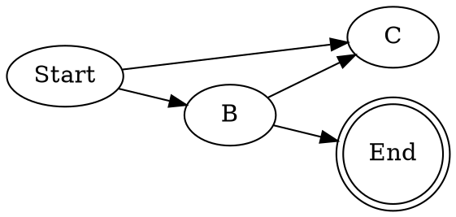
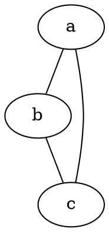
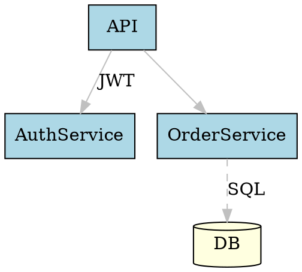
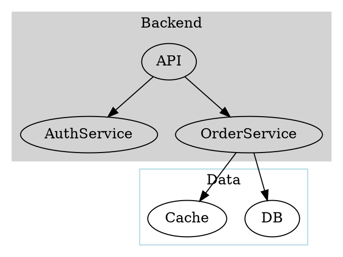

# graphviz — Graph Visualization

Renders graph descriptions written in the DOT language into diagrams (PNG, SVG,
PDF). Installed as a PlantUML dependency but useful standalone.

## Core commands

```bash
dot -Tpng graph.dot -o graph.png       # directed graph → PNG
dot -Tsvg graph.dot -o graph.svg       # → SVG
neato -Tpng graph.dot -o graph.png     # undirected, spring layout
circo -Tpng graph.dot -o graph.png     # circular layout
fdp -Tpng graph.dot -o graph.png       # force-directed layout
```

## Layout engines

| Command | Best for |
|---------|---------|
| `dot`   | Directed graphs, hierarchies, DAGs |
| `neato` | Undirected graphs, network diagrams |
| `circo` | Circular/ring layouts |
| `fdp`   | Undirected, force-directed |
| `sfdp`  | Large undirected graphs |
| `twopi` | Radial layouts |

## DOT language basics

### Directed graph



### Undirected graph



### Styled nodes and edges



### Subgraphs / clusters



## Generating from the command line

```bash
# Render and open
dot -Tsvg arch.dot -o arch.svg && open arch.svg

# Pipe DOT from stdin
echo 'digraph { A -> B -> C }' | dot -Tpng -o quick.png

# Batch render all .dot files
for f in *.dot; do dot -Tsvg "$f" -o "${f%.dot}.svg"; done
```

## Use-cases

- Dependency graphs for packages or modules
- State machine diagrams
- Infrastructure topology diagrams
- Call graphs from code analysis tools
- Quick ad-hoc diagrams: `echo 'digraph { A->B->C }' | dot -Tpng -o g.png`
