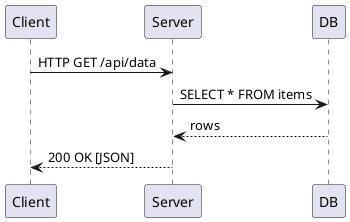
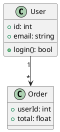
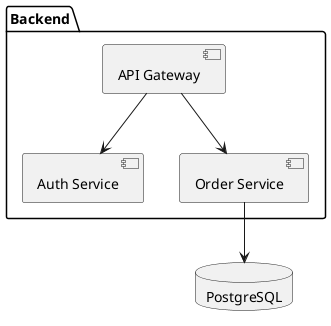
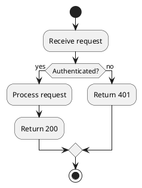
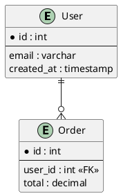

# plantuml — Diagram Generation from Text

Generates diagrams (sequence, class, component, ER, activity, etc.) from
plain-text `.puml` files. Graphviz is installed alongside it for graph layouts.

## Basic usage

```bash
plantuml diagram.puml                   # generate PNG (default)
plantuml -tsvg diagram.puml            # generate SVG
plantuml -tpdf diagram.puml            # generate PDF
plantuml -o output/ diagram.puml       # output to a specific directory
plantuml *.puml                         # batch process all .puml files
```

## Diagram types

### Sequence diagram



### Class diagram



### Component / architecture diagram



### Activity / flowchart



### ER diagram



## Flags

| Flag | Meaning |
|------|---------|
| `-tpng` | PNG output (default) |
| `-tsvg` | SVG output (scalable, good for docs) |
| `-tpdf` | PDF output |
| `-o dir` | Output directory |
| `-charset UTF-8` | Explicit charset |
| `-checkonly` | Validate syntax without generating |
| `-language` | Print all keywords |

## Neovim integration

With the playbook's Neovim config, `.puml` files may render previews via a
plugin like `weirongxu/plantuml-previewer.vim`.

## Use-cases

- Architecture diagrams in project docs (committed as `.puml`, rendered to SVG)
- Sequence diagrams for API documentation
- ER diagrams generated from schema
- Keeping diagrams in version control alongside code (text = diffable)
